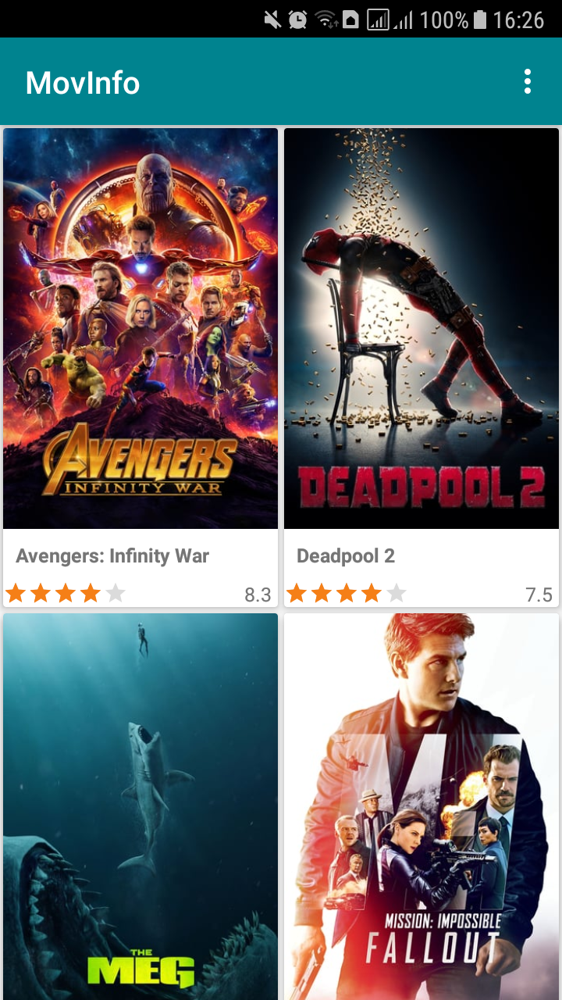
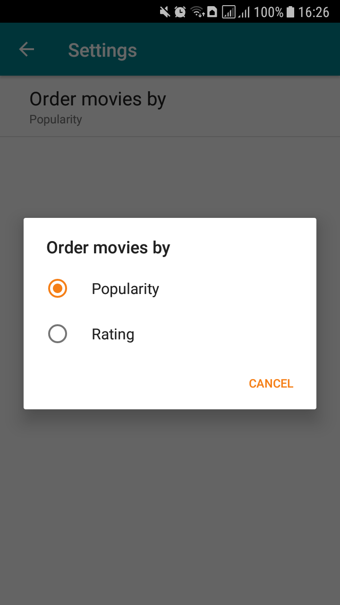

# Movinfo

An android application to discover the currently popular movies.

    
  

## Installation
Clone this repository and import into **Android Studio**
```bash
git clone https://github.com/EddyMM/movinfo-app.git
```

### Adding an API key

- Create an account with [The Movie DB](https://www.themoviedb.org/)
- Get an API key from your account settings
- Add the API key to the **global `gradle.properties`** file 
and use the variable `TheMovieDbApiToken`
- For example:
`TheMovieDbApiToken="<Your API Key>"`

## Maintainers
This project is mantained by:
* [Eddy mwenda](https://github.com/EddyMM)


## Contributing

1. Fork it
2. Create your feature branch (git checkout -b my-new-feature)
3. Commit your changes (git commit -m 'Add some feature')
4. Run the linter (ruby lint.rb').
5. Push your branch (git push origin my-new-feature)
6. Create a new Pull Request
